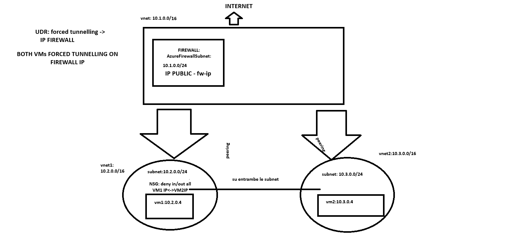
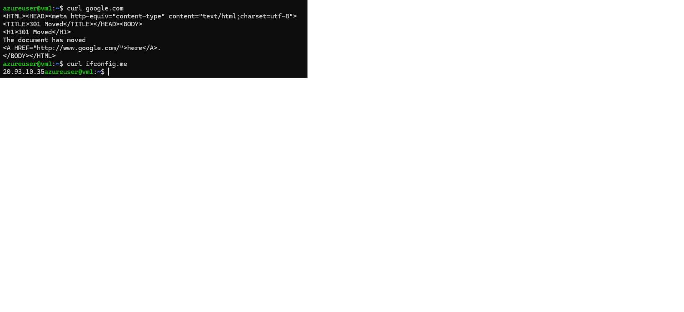
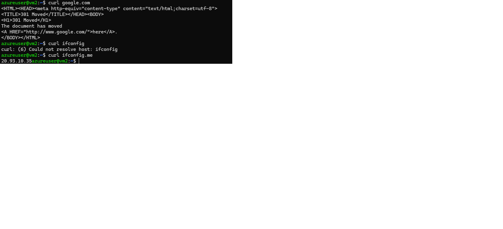
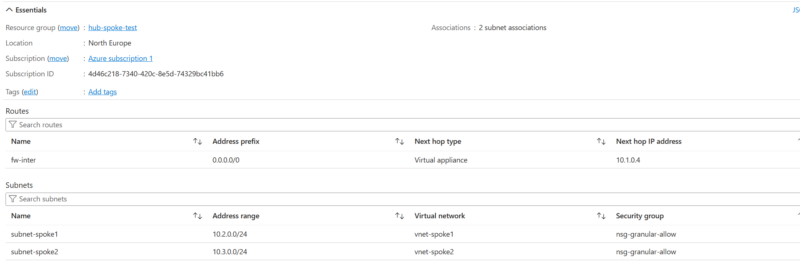
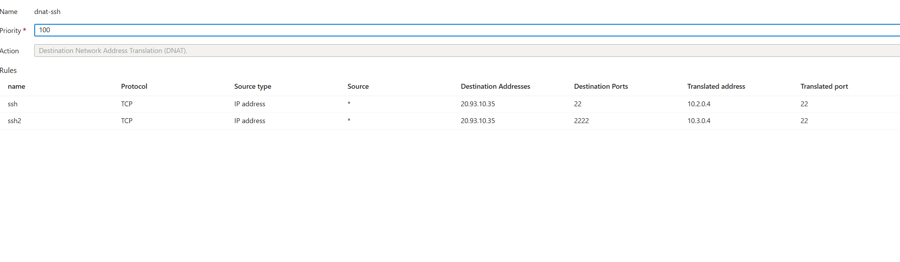

# Hub-and-Spoke with Azure Firewall (Forced Tunneling)

## Overview
Implemented a hub-and-spoke architecture with Azure Firewall to control both outbound and inbound traffic.

## Architecture
- Hub VNet (10.1.0.0/16) with Azure Firewall
- Spoke VNets (10.2.0.0/16, 10.3.0.0/16) with VMs
- VNet peering (Hub ↔ Spokes)
- UDR forcing all outbound traffic (0.0.0.0/0) through the firewall
- NSG applied at subnet level

## Traffic Flow
- Outbound: VM → UDR → Firewall → Internet
- Inbound: Internet → Firewall (DNAT) → VM

## Configuration Highlights
- Application rule allowing HTTP/HTTPS outbound
- Network rule allowing SSH (port 22)
- DNAT rules:
  - Port 22 → VM1
  - Port 2222 → VM2

## Validation
- SSH access through firewall public IP
- Internet connectivity from VMs confirmed
- Public IP check shows firewall IP

## Screenshots

### Architecture

### SSH via Firewall

### Outbound IP (Forced Tunneling)

### Firewall DNAT

### UDR Configuration

## Lessons Learned
- NSG alone is not sufficient when using Azure Firewall
- UDR controls routing, firewall controls traffic
- DNAT is required for inbound connectivity
- Forced tunneling ensures all outbound traffic is inspected
